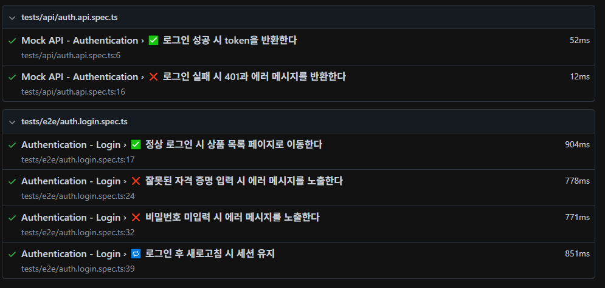

# QA Automation Portfolio (Playwright)

> **목표:**  
> 로그인 기능을 중심으로 **E2E(UI) + API 레벨 테스트 자동화**를 설계·구현한 포트폴리오입니다.
> 단순 테스트 작성이 아니라, **실행 환경 제약(외부 API 403 차단)을 분석 → Mock 서버로 테스트 인프라 재설계**하는 등의 **문제 해결 능력과 자동화 전략 수립 능력**을 중심으로 구성했습니다.
---

## 1. 개요

이 프로젝트는 다음 목표를 기반으로 합니다:

### ✔ 1) 로그인 기능 자동화 설계 능력 증명  
성공 / 실패 / 예외 / 세션 유지 등 핵심 인증 시나리오 자동화

### ✔ 2) UI(E2E) + API 테스트 분리  
UI는 실제 사용자 흐름 중심  
API는 Mock 서버 기반으로 안정적인 상태 코드/응답 검증

### ✔ 3) 환경 제약 해결 능력  
외부 API가 403을 반환하는 환경에서  
Mock API 서버를 직접 구성하여 테스트 재현성과 안정성을 확보

---

## 2. 기술 스택

- **Language:** TypeScript / JavaScript
- **Test Framework:** Playwright
- **Mock API Server:** Node.js + Express
- **Package Manager:** npm
- **테스트 유형:** E2E(UI) 테스트 + API 테스트 

---

## 3. 폴더 구조

```bash
qa-automation/
│
├── README.md
├── playwright.config.ts
│
├── mock-server/
│   ├── mock-server.js
│   ├── package.json
│   └── node_modules/
│
├── docs/
│   ├── automation-strategy.md
│   └── test-scenarios.md
│
└── tests/
    ├── e2e/
    │   └── auth.login.spec.ts
    └── api/
        └── auth.api.spec.ts
```
        

## 4. 자동화 범위

## 🟦 E2E(UI) 테스트 — SauceDemo
- 정상 로그인  
- 잘못된 PW 입력  
- 비밀번호 미입력  
- 로그인 후 새로고침 시 세션 유지  

UI 테스트는 실제 브라우저 동작 기반으로 사용자 플로우를 검증합니다.

---

## 🟨 API 테스트 — Mock API 서버
Mock 서버(`http://localhost:4000`)를 직접 구성하여:

- 로그인 성공: `200 OK` + token  
- 로그인 실패: `401 Unauthorized` + error 메시지  

외부 API가 403으로 차단되는 환경에서도 **안정적/재현 가능한 테스트 환경**을 구축했습니다.

---
## 전체 테스트 실행 결과


---

# ⭐ 5. 핵심 설계 포인트

### ✔ UI / API 테스트 완전 분리  
문제 원인 분석 속도 ↑, 유지보수성 ↑

### ✔ Mock API 서버 도입  
환경 제약을 테스트 설계로 해결  
“테스트는 항상 재현 가능해야 한다”는 QA 원칙 반영

### ✔ 실패 시나리오 중심 설계  
QA 관점에서 가장 중요한 **"어떻게 실패하는가?"** 에 집중

### ✔ 문서화 능력  
테스트 전략 · 시나리오를 별도 문서(docs/)로 정리해  
확장과 협업을 고려한 구조화된 포트폴리오

---

# 🙋‍♀️ 6. 프로젝트 의도 · 자동화 역량 포인트

이 프로젝트는 **테스트 자동화 업무를 실제 실무 환경 수준으로 재현하고,  
그 과정에서 요구되는 문제 해결 능력과 자동화 설계 역량을 명확히 드러내기 위해** 제작되었습니다.

외부 API가 403을 반환하는 환경 제약을 단순 에러로 넘기지 않고,  
Mock API 서버를 직접 구축해 **안정적이고 재현 가능한 테스트 인프라**를 구성했습니다.  

또한 UI(E2E) 테스트와 API 테스트를 완전히 분리해  
**서비스 레이어별로 독립적인 검증이 가능하도록 설계**함으로써  
자동화 구조의 유지보수성과 확장성을 강화했습니다.

이 프로젝트는 다음 역량을 명확하게 보여줍니다:

- 테스트 자동화 시나리오 정의 능력  
- Mock 기반 테스트 환경 구성 능력  
- UI(E2E)와 API 레벨의 테스트 아키텍처 이해  
- 실패 시나리오 중심의 검증 설계 능력  
- 테스트 인프라를 직접 구축할 수 있는 실무형 문제 해결 능력

이 포트폴리오는 단순 테스트 예제가 아니라,  
**실제 서비스 자동화를 설계·구축하는 데 필요한 사고 방식과 기술적 판단을 담고 있습니다.**

---